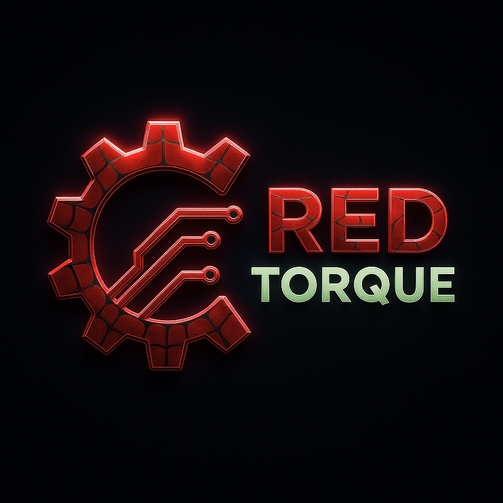
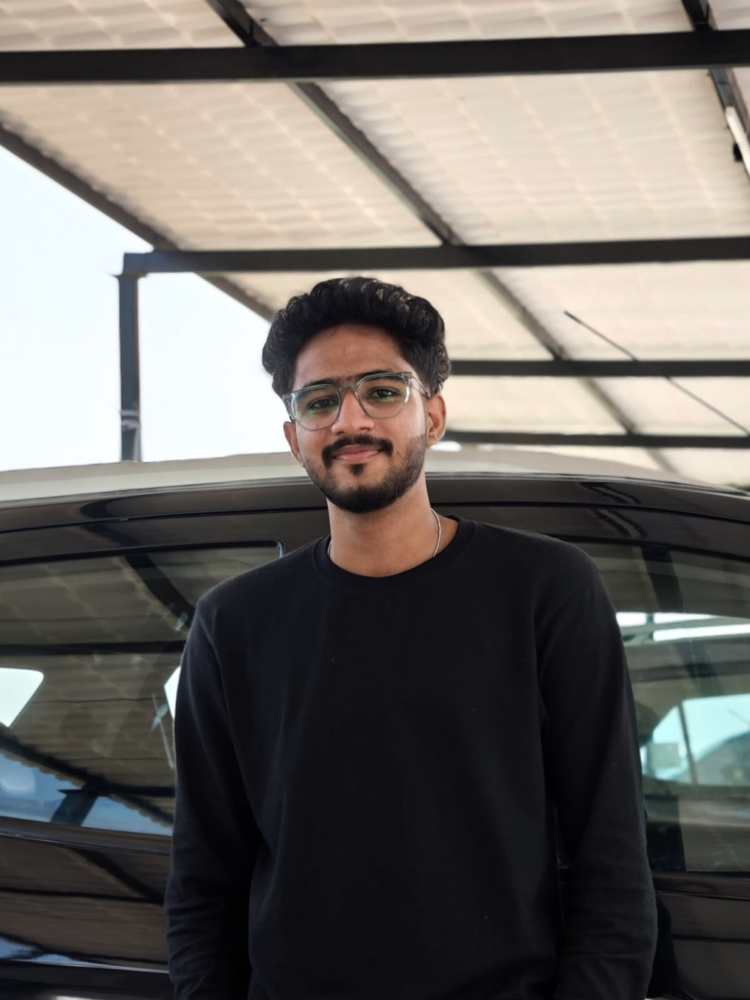
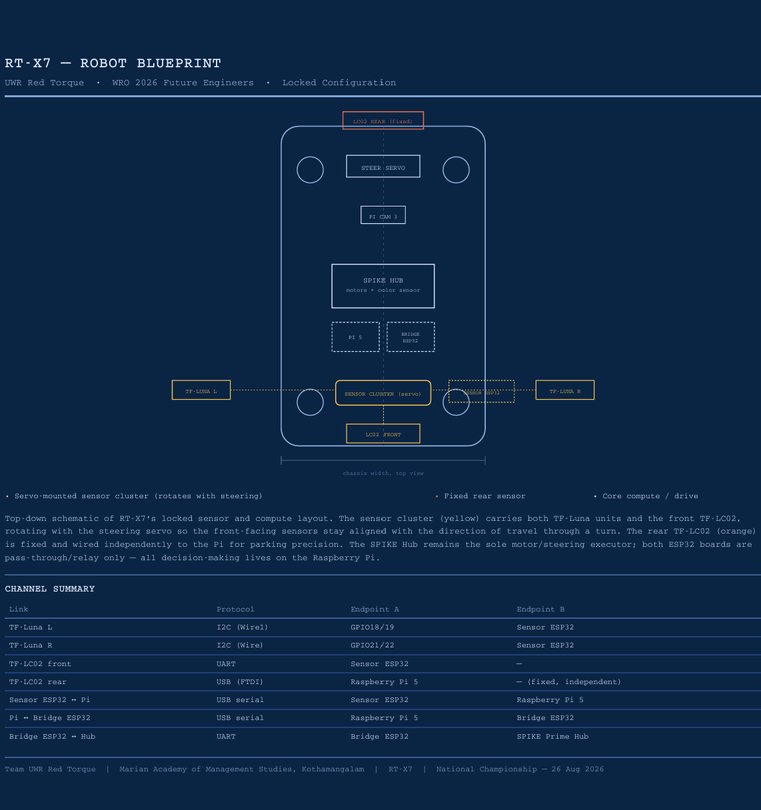

<p align="center">
  
</p>

<h1 align="center">RT-X7 — Team Red Torque</h1>
<h3 align="center">UWR Red Torque · Marian Academy of Management Studies, Kothamangalam</h3>

<p align="center">
  <b>WRO Future Engineers 2026 — National Championship</b><br/>
  📅 26 August 2026 &nbsp;|&nbsp; 📍 GMR Arena, GMR Aerocity, Hyderabad
</p>

<p align="center">
  <a href="https://github.com/Red-Torque/Red-Torque-26">Repository</a> •
  <a href="#team">Team</a> •
  <a href="#mobility-management">Mobility</a> •
  <a href="#power-and-sense-management">Power & Sense</a> •
  <a href="#software-architecture">Software</a> •
  <a href="#systems-thinking--engineering-decisions">Systems Thinking</a> •
  <a href="#engineering-notebook">Engineering Notebook</a>
</p>

---

> RT-X7 is a fully autonomous self-driving robot built by Team Red Torque for the WRO Future Engineers 2026 challenge. This repository documents our full engineering process — design decisions, hardware, source code, testing, and reflection — from prototype to competition.

## Table of Contents

- [1. Team](#team)
- [2. Overview](#overview)
- [3. Content Structure](#content-structure)
- [4. Mobility Management](#mobility-management)
- [5. Power and Sense Management](#power-and-sense-management)
  - [5.1 Processing Units](#51-processing-units)
  - [5.2 Sensors](#52-sensors)
  - [5.3 Power Budget](#53-power-budget)
- [6. Navigation & Obstacle Management](#navigation--obstacle-management)
- [7. Software Architecture](#software-architecture)
- [8. Systems Thinking & Engineering Decisions](#systems-thinking--engineering-decisions)
- [9. Source Code Structure](#source-code-structure)
- [10. List of Components](#list-of-components)
- [11. Engineering Notebook](#engineering-notebook)
- [12. Reproducibility](#reproducibility)
- [13. License](#license)

> Every section above corresponds to an actual heading below — nothing in this ToC is unused, and every `##` heading in the file has an entry here.

---

## Team

**Team Name:** UWR Red Torque
**Coach:** Jithu Joseph

### Team Members

<table align="center">
<tr>
<td align="center" width="33%">
<br/>
<b>Adithya Sree Sivaramanand</b><br/>
<i>Hardware Design & Motor Control</i>
</td>
<td align="center" width="33%">
<br/>
<b>Albin Binu K</b><br/>
<i>Microcontrollers, Firmware Programming & GitHub Documentation</i>
</td>
<td align="center" width="33%">
<br/>
<b>Allwin Boban</b><br/>
<i>Physical Documentation & Design</i>
</td>
</tr>
</table>

**Adithya Sree Sivaramanand** — *Hardware Design & Motor Control*
Adithya is a BCA student with a passion for artificial intelligence and robotics. He is responsible for the hardware architecture, motor control, and electronics integration of the RoboCar. He enjoys building innovative solutions, experimenting with new technologies, and solving engineering challenges. Adithya is also a **Bronze Rank holder, WRO Future Engineers Challenge (FEC) 2025**.

**Albin Binu K** — *Microcontrollers, Firmware Programming & GitHub Documentation*
Albin is a BCA student responsible for microcontroller firmware, the ESP32/Raspberry Pi software stack, and repository documentation. He enjoys applying classroom knowledge to real-world robotics projects and has a strong interest in embedded electronics, open-source development, entrepreneurship, and technology-driven innovation. Albin is also a **Bronze Rank holder, WRO Future Engineers Challenge (FEC) 2025**.

**Allwin Boban** — *Physical Documentation & Design*
Allwin is a sixth-semester BCA student with a strong interest in robotics, mechanical design, and technical documentation. He is responsible for the robot's physical build documentation and design records, capturing the chassis, mounts, and mechanical iterations that shaped RT-X7.

Together, we combine expertise in hardware engineering, embedded systems, and software development to build reliable autonomous robots for the World Robot Olympiad (WRO) Future Engineering Challenge.

[Back To Top](#rt-x7--team-red-torque)

---

## Overview

RT-X7 combines a LEGO Technic chassis with a hybrid electronics stack for autonomous navigation. Processing and sensing are deliberately split across four units, each handling a distinct role in the pipeline:

- **Raspberry Pi 5** — the decision-making core. Runs computer vision (Pi Camera Module 3 Wide, CSI) and all PID / wall-following logic. Also reads the **rear TF-LC02 directly over USB** for parking precision.
- **Sensor ESP32** — reads the **left and right TF-Luna** (dual independent I²C buses) and the **front TF-LC02** (UART), and streams all three readings to the Pi. This ESP32 also drives the **angular servo motor** that physically rotates the left/right/front sensor cluster as the vehicle steers, keeping the sensors aimed correctly through turns instead of just discounting their readings in software.
- **Bridge ESP32** — a pure relay: takes the Pi's steering/throttle decisions and forwards them to the LEGO SPIKE Prime Hub over UART.
- **LEGO SPIKE Prime Hub** — the execution layer. Runs Pybricks, drives the propulsion motor(s) and the **angular servo motor used for steering** (LEGO's own motor acting as the steering actuator), and independently tracks laps using its built-in IMU and the LEGO color sensor on the blue/orange boundary lines.

**Signal flow, end to end:**

```
Left/Right TF-Luna ─┐
Front TF-LC02       ├──► Sensor ESP32 (+ drives sensor-cluster servo) ──► Raspberry Pi 5
                     │                                                         │
Rear TF-LC02 ────────┴── USB ───────────────────────────────────────────────►  │
                                                                               │
                                                          steering/throttle decision
                                                                               │
                                                                               ▼
                                                                       Bridge ESP32
                                                                               │
                                                                               ▼
                                                                LEGO SPIKE Prime Hub
                                                          (drives steering servo + motors,
                                                           tracks laps via color sensor + IMU)
```

This keeps vision + PID computation on the Pi (which has the headroom for it), leaves motor/steering execution to the Hub (fast, low-latency), and uses the two ESP32s to cleanly separate "read sensors + aim them" from "relay commands."

[Back To Top](#rt-x7--team-red-torque)

---

## Content Structure

This matches the folder layout in the [repository](https://github.com/Red-Torque/Red-Torque-26):

| Folder / File | Contents |
|---|---|
| `Components/` | `components.md` + Detailed Components Study PDF |
| `t_photos/` | Team + coach photos |
| `v_photos/` | Front / back / left / right / top / bottom images of RT-X7 |
| `v_videos/` | Video footage of RT-X7 |
| `engineering_workflow/` | Engineering diagrams, including the RT-X7 blueprint |
| `src/open_challenge/` | Open Challenge source code |
| `src/obstacle_challenge/` | Obstacle Challenge source code |
| `engineering-notebook/` | EN-001–EN-020 journal entries with diagrams |
| `Readme.md` | This file |
| `LICENSE` | Repo license (MIT) |

[Back To Top](#rt-x7--team-red-torque)

---

## Mobility Management

RT-X7's drivetrain and steering are built on a **LEGO Technic chassis** using **Ackermann steering geometry**. Steering is actuated by an **angular servo motor built into the LEGO system itself**, commanded by the SPIKE Prime Hub — the Hub is the execution layer, translating steering/throttle decisions computed on the Pi into physical motor output. Propulsion uses the chassis's DC motor(s), also driven from the Hub.

Wall-following and obstacle-avoidance *decision-making* (the PID logic) intentionally does **not** live on the Hub — it lives on the Raspberry Pi 5, which computes steering corrections and sends them, via the Bridge ESP32, to the Hub for execution. This was a key architecture decision made early on, correcting an initial misunderstanding that had placed navigation logic on the ESP32 layer instead.

### Drive & Steering Justification

| Design Choice | Reasoning |
|---|---|
| LEGO Technic chassis + Ackermann steering geometry | Ackermann geometry keeps all wheels rolling without scrubbing through a turn, giving more predictable PID response than a skid-steer setup; LEGO Technic gave the team fast mechanical iteration during prototyping |
| Angular servo motor for steering (LEGO-native) | Keeps steering actuation inside the Hub's own motor control rather than adding an external servo driver/PWM source, reducing wiring and one more potential point of failure |
| Motor/gear ratio selection | Propulsion uses a **LEGO Technic Large Angular Motor** (stall torque ≈ 1.5 N·m, no-load speed ≈ 170 rpm at 8 V) run near-direct-drive to the rear axle for responsive acceleration out of turns. Steering uses a **LEGO Technic Medium Angular Motor**, chosen specifically for its built-in absolute position sensor — critical for repeatable, closed-loop steering angles rather than open-loop timed pulses. |
| Wheel/tire choice | Standard LEGO Technic rubber tires, chosen over hard plastic wheels for the extra grip they give on the WRO mat's matte surface — the added rolling resistance was an acceptable trade-off since it made PID response more predictable (less wheel slip meant steering corrections translated into actual heading change more consistently). |

> Motor specs above are typical values for this LEGO motor family — swap in your own measured/logged numbers if you bench-test stall torque or speed directly.

### Mechanical Stability & Iteration

Adding the sensor-cluster servo (left/right TF-Luna + front TF-LC02 on a single rotating mount) shifted weight forward and slightly off the chassis centerline. Early bench testing showed this made the front end more prone to dip under hard braking, so the mount bracket was reinforced with an additional Technic beam and moved as close to the steering axis as the sensors' field of view allowed, minimizing the torque arm from the extra mass. The rear TF-LC02, being a fixed mount, was kept low and centered to avoid affecting weight distribution during the reverse-parking maneuver.

<p align="center">
  
</p>

Full robot photography (front / back / left / right / top / bottom) is available in [`v_photos/`](./v_photos).

[Back To Top](#rt-x7--team-red-torque)

---

## Power and Sense Management

### 5.1 Processing Units

| Unit | Role |
|---|---|
| Raspberry Pi 5 | Vision (Camera Module 3 Wide, CSI/`picamera2`) + all PID/wall-following logic + reads rear TF-LC02 directly over USB |
| Sensor ESP32 | Reads left/right TF-Luna (dual I²C buses) + front TF-LC02 (UART); drives the sensor-cluster steering servo; streams data to the Pi |
| Bridge ESP32 | Pure relay — forwards the Pi's steering/throttle decisions to the SPIKE Prime Hub over UART |
| LEGO SPIKE Prime Hub | Execution layer — drives propulsion + steering servo, tracks laps via built-in IMU and color sensor |

### 5.2 Sensors

| Sensor | Qty | Interface | Role |
|---|---|---|---|
| TF-Luna | 2 | I²C to Sensor ESP32 — each on its own independent bus (`Wire` GPIO21/22, `Wire1` GPIO18/19) | Left/right wall-following; mounted on the sensor-cluster servo |
| TF-LC02 (front) | 1 | UART to Sensor ESP32, **3.3V only** | Front obstacle detection; mounted on the sensor-cluster servo |
| TF-LC02 (rear) | 1 | **USB directly to Raspberry Pi 5** | Rear parking precision — fixed mount, not on the servo |
| LEGO Color Sensor | 1 | Native LEGO Hub port | Lap counting via blue/orange track lines |
| Pi Camera Module 3 Wide | 1 | CSI (`picamera2`) | Vision — detects red/green obstacle cubes |
| SPIKE Hub built-in IMU | 1 | Internal | Heading reference |

**Why the sensor cluster is servo-mounted:** the left/right TF-Luna and front TF-LC02 are mounted together on an angular servo motor controlled by the Sensor ESP32. As the vehicle steers, this servo rotates the cluster to keep the sensors correctly aimed relative to the track walls and any obstacle ahead — this replaced our earlier plan of only reducing front-sensor trust in software during turns, since physically re-aiming the sensors gives more accurate readings through a turn rather than just distrusting a blind-spot reading. See [Systems Thinking](#systems-thinking--engineering-decisions) for how this decision evolved.

**Why the rear TF-LC02 is on USB, not the Sensor ESP32:** it's used only for the parking maneuver, which is a Pi-driven state late in a run — reading it directly over USB keeps that logic self-contained on the Pi without adding it to the Sensor ESP32 → Pi relay stream that the other three sensors already share.

**Why dual I²C buses for the TF-Luna sensors:** the standard approach of changing one sensor's I²C address to avoid collisions reported success on the device but did not persist on real hardware. Rather than continue fighting that unreliable behavior, we moved each TF-Luna onto its own independent I²C bus on the Sensor ESP32 — confirmed working via a live hardware scan (0x10 detected on `Wire1`). We also found, only in a newer revision of the datasheet, that TF-Luna's I²C mode requires grounding pin 5 (mode select).

**Why the TF-LC02 units are 3.3V only:** this is a hard constraint carried through every revision of our wiring and documentation — neither TF-LC02 must ever be connected to a 5V rail.

### 5.3 Power Budget

| Component | Supply (V) | Typical Current | Notes |
|---|---|---|---|
| Raspberry Pi 5 | 5 | ~1.2 A idle, up to 3 A under load with camera + USB peripherals active | Pi 5 officially recommends a 5V/5A supply headroom |
| SPIKE Prime Hub + motors (propulsion + steering servo) | 7.4 (Hub Li-ion) | ~0.3 A idle, up to ~1.5 A per motor at stall | Stall current is the worst case — brief, during hard acceleration or a steering motor hitting a limit |
| Sensor ESP32 (+ sensor-cluster servo) | 3.3–5 | ~0.18 A (Wi-Fi active) + up to ~0.5 A servo peak during motion | Servo current draw can spike during motion — include peak, not just idle |
| Bridge ESP32 | 3.3–5 | ~0.15 A (UART relay only, Wi-Fi can be disabled to save power) | |
| TF-Luna ×2 | 5 / 3.3 | ~0.14 A each (~0.28 A combined) | |
| TF-LC02 ×2 | 3.3 | ~0.05 A each (~0.1 A combined) | Never wire to 5V — see above |
| Camera Module 3 Wide | 3.3 | ~0.25 A | |

> Combined worst-case draw is roughly 6–7 A across rails — comfortably within the 3518 buck converter's USB-C PD3.0/QC4.0 capacity, but confirm with an actual multimeter reading under full load (all motors + Wi-Fi + camera active simultaneously) before relying on this table for competition day.

**Sensor placement rationale (field geometry):** the two TF-Luna sensors face left/right for continuous wall-distance feedback along the track edges, since the WRO field's inner/outer walls are the primary reference the PID loop needs. The front TF-LC02 faces forward to catch obstacle pillars before the car reaches them. All three ride on the sensor-cluster servo so their aim tracks the vehicle's steering angle rather than staying fixed relative to the chassis. Mounted roughly level with the LiDAR units' rated optimal detection height (a few cm above the mat surface, angled slightly downward to avoid overshooting past low obstacle pillars), with the servo's zero (center) position calibrated to straight-ahead. The rear TF-LC02 is fixed, facing backward, mounted low and centered to see the parking wall/markers during the reverse-parking maneuver.

**Calibration method:** before each run, the TF-Luna sensors are zeroed against a known wall distance (car placed at a fixed, measured distance from a flat surface, reading compared against that known value to catch drift). The sensor-cluster servo's center position is calibrated so 0° output corresponds to the wheels pointing straight ahead — verified visually against a straight-edge before competition runs. The camera's exposure and white balance are locked once under the venue's actual lighting rather than left on auto, since auto-exposure drifting mid-run was identified as a risk to consistent red/green cube classification. TF-LC02 units are checked against a fixed reference distance the same way as the TF-Luna sensors.

**Failure-point considerations:**
- TF-Luna I²C address collisions were a known failure mode — solved permanently via dual independent I²C buses rather than relying on address-change commands, which reported success but didn't persist on hardware.
- TF-LC02 is 3.3V-only; accidental 5V connection would destroy the sensor — this constraint is called out in every wiring reference so it isn't reintroduced by mistake.
- The sensor-cluster servo is a new single point of mechanical failure (linkage wear, servo horn slip) that didn't exist under the software-only approach — mitigated with a mechanical limit stop on either end of its rotation range, and a pre-run visual check of the linkage for play.
- Other known failure points: the CSI ribbon cable to the camera can work loose under vibration (addressed with a small cable clip securing it to the chassis); an ESP32 brownout is possible if the servo and Wi-Fi both draw peak current simultaneously (mitigated by giving each ESP32 its own regulated feed off the buck converter rather than daisy-chaining power); the rear TF-LC02's USB connection is the most exposed physical connector on the chassis and is the first thing checked if the parking state misbehaves.

Power is delivered through a **3518-chip Type-C USB QC4.0/PD3.0 buck converter module**. An earlier DC-DC screw-terminal buck module was removed from the design in favor of this module for improved reliability. A wiring diagram is maintained alongside `Components/components.md`; see the [Systems Thinking](#systems-thinking--engineering-decisions) table below for why the switch was made.

[Back To Top](#rt-x7--team-red-torque)

---

## Navigation & Obstacle Management

RT-X7's navigation logic runs on the Raspberry Pi 5, fusing camera vision with LiDAR distance data arriving via two paths — the Sensor ESP32 relay (left/right TF-Luna + front TF-LC02) and a direct USB link (rear TF-LC02):

1. **Wall-following (PID)** — the two side-facing TF-Luna sensors feed distance readings to a PID loop on the Pi, which computes steering corrections. These are sent to the Bridge ESP32, which relays them to the SPIKE Hub for execution.
2. **Front obstacle detection** — the front-facing TF-LC02 detects obstacles ahead; the camera is used to identify red/green obstacle cubes. Because the front sensor rides on the sensor-cluster servo, it stays aimed correctly through a turn instead of losing the obstacle at the edge of a fixed field of view.
3. **Rear parking precision** — the rear TF-LC02, read directly over USB, assists with precise reversing during the parking maneuver.
4. **Lap counting** — handled independently on the SPIKE Hub via the LEGO color sensor detecting blue/orange boundary lines, decoupling lap tracking from the Pi's vision/PID pipeline.

[Back To Top](#rt-x7--team-red-torque)

---

## Software Architecture

### State Machine

RT-X7's Pi-side control loop is organized as a state machine so each phase of a run has clearly bounded logic:

```
INIT → LANE_FOLLOW ⇄ OBSTACLE_AVOID
                ↓
            LAP_COMPLETE (after 3 laps, via Hub color-sensor count)
                ↓
              PARK → STOP
```

- **INIT** — sensors and camera initialize; Sensor ESP32 and Bridge ESP32 links are verified alive before the run starts.
- **LANE_FOLLOW** — default state; PID loop on the Pi uses TF-Luna left/right distances to hold the car centered between walls; the sensor-cluster servo tracks the current steering angle.
- **OBSTACLE_AVOID** — triggered when the front TF-LC02 or camera detects an obstacle inside a threshold distance; a corrective offset is blended into the steering command.
- **LAP_COMPLETE** — the Hub's independent lap counter (color sensor on blue/orange lines) signals lap 3 is done; the Pi transitions to parking.
- **PARK** — the rear TF-LC02, read over USB, guides the reverse-parking maneuver.
- **STOP** — motors commanded to zero, run ends.

This flow is also captured as a diagram in the engineering notebook (EN series) alongside the Pi-side code that implements each transition.

### Algorithm Justification

| Algorithm | Where used | Why chosen |
|---|---|---|
| PID (wall-following) | Pi, using TF-Luna left/right distance | Simple, low-latency, well suited to a fixed sensor geometry and consistent field-wall reflectivity |
| Sensor-cluster servo tracking | Sensor ESP32, synced to steering angle | Keeps left/right/front sensors correctly aimed through turns — see [Systems Thinking](#systems-thinking--engineering-decisions) for why this replaced a software-only fix |
| IMU heading reference | SPIKE Hub | Built into the execution layer already, avoids duplicating heading sensing on the Pi |
| Computer vision (obstacle cube color detection) | Pi, `picamera2`/OpenCV | Frames are converted to HSV and thresholded against tuned red/green ranges (HSV is more lighting-tolerant than RGB thresholding), followed by contour detection to find the largest matching blob and estimate the cube's position relative to the car's centerline |

**Handling edge cases:**
- Front-sensor blind spot during active turns → mechanically compensated by the sensor-cluster servo (see Systems Thinking).
- I²C address collisions between identical TF-Luna units → dual independent buses (see Power & Sense Management).
- Lighting changes affecting camera-based cube detection → HSV thresholds are re-checked under venue lighting rather than left tuned to workshop lighting, and exposure/white balance are locked (see Power & Sense Management's calibration notes).
- Servo lag during fast steering transitions → the PID loop's correction magnitude is capped so steering commands don't outrun the sensor-cluster servo's physical slew rate, avoiding a mismatch between where the sensors are aimed and where the wheels are pointed.

**Testing / tuning process:** PID gains were tuned iteratively on a taped-out mock track approximating the WRO field's wall spacing, starting with proportional gain only (increased until the car reliably oscillated, then backed off), then adding derivative gain to damp that oscillation, then a small integral term to correct steady-state drift toward one wall. Each iteration was judged against wall touches per lap and lap consistency (time variance across repeated laps) rather than raw lap time alone, since a fast but unstable run scores worse in obstacle rounds than a slightly slower, consistent one.

[Back To Top](#rt-x7--team-red-torque)

---

## Systems Thinking & Engineering Decisions

RT-X7's architecture is the result of several explicit trade-offs, documented as they were made rather than reconstructed afterward:

| Decision | Alternative considered | Why we chose what we did |
|---|---|---|
| PID/navigation logic on the Pi, not the Hub or an ESP32 | Running navigation logic directly on the SPIKE Hub or on an ESP32 | The Hub is fast to actuate but limited for heavier real-time computation; the Pi has the headroom for vision + PID together. This corrected an earlier architecture misunderstanding that had placed navigation on the ESP32 layer. |
| Dual independent I²C buses for TF-Luna | Reassigning one sensor's I²C address at runtime | Address-change commands reported success but didn't persist on real hardware — an unreliable fix. Dual buses eliminate the collision permanently and were confirmed via a live hardware scan. |
| Servo-mounted left/right/front sensor cluster, synced to steering | Static sensor mounts + software-only trust reduction during turns (our original plan) | Physically re-aiming the sensors through a turn gives more accurate readings than simply discounting a fixed sensor's output — an example of the design evolving once the blind-spot problem was better understood. We accepted the added mechanical complexity (a new servo, linkage) as worth it for the accuracy gain. |
| Rear TF-LC02 on direct USB to the Pi, separate from the Sensor ESP32 relay | Routing all four LiDAR sensors through one ESP32 relay | The rear sensor is only used for the late-run parking state; keeping it on its own USB link avoids adding a fourth stream to the Sensor ESP32 → Pi relay and keeps parking logic self-contained. |
| 3518-chip USB-C buck converter | DC-DC screw-terminal buck module (originally used) | The screw-terminal module's connections loosened under the vibration of normal driving, causing intermittent brownouts that were hard to diagnose since they looked like software faults. The USB-C module's locking connector removed that failure mode entirely, at the cost of losing fine-grained voltage-trim control the screw-terminal version offered. |

### Risk Identification & Mitigation

| Risk | Likelihood | Mitigation |
|---|---|---|
| TF-LC02 accidentally wired to 5V, destroying the sensor | Medium (easy wiring mistake) | 3.3V-only constraint called out in every wiring reference; consider color-coding or labeling the 3.3V rail physically |
| TF-Luna I²C collision recurring | Low (solved via dual bus) | Dual independent buses; verified via hardware scan before integration |
| Sensor-cluster servo linkage wear or slip | Medium (new mechanical part) | Mechanical limit stops on both ends of rotation; linkage visually inspected before each competition run |
| Rear TF-LC02 USB connection coming loose mid-run | Medium (most exposed connector on the chassis) | Strain relief on the USB cable, routed and clipped away from moving parts; connection checked as part of pre-run setup |
| Power brownout under combined motor/servo current spikes | Medium (multiple actuators can peak simultaneously) | Each ESP32 given its own regulated feed off the buck converter rather than sharing a rail with the motors; buck converter sized with headroom above the worst-case combined draw (see Power Budget) |

[Back To Top](#rt-x7--team-red-torque)

---

## Source Code Structure

```
Red-Torque-26/
├── Components/
│   ├── Detailed Components study.pdf
│   └── components.md
├── engineering_workflow/       # diagrams, incl. RT-X7 blueprint
├── engineering-notebook/       # EN-001–EN-020 journal entries
├── t_photos/                   # team + coach photos
├── v_photos/                   # robot photos
├── v_video/                    # robot video footage
├── src/
│   ├── open_challenge/          # Open Challenge Pybricks/Python/Arduino code
│   └── obstacle_challenge/      # Obstacle Challenge code
└── Readme.md
```

**Source layout** (mirrors the architecture above):

```
src/
├── open_challenge/
│   └── ...                      # Open Challenge Pybricks/Python code
├── obstacle_challenge/
│   ├── pi/                      # Raspberry Pi — vision, PID, state machine
│   ├── sensor_esp32/            # Sensor ESP32 firmware — TF-Luna, front TF-LC02, cluster servo
│   ├── bridge_esp32/            # Bridge ESP32 firmware — Pi ↔ Hub relay
│   └── hub/                     # Pybricks code for the SPIKE Prime Hub
```

[Back To Top](#rt-x7--team-red-torque)

---

## List of Components

| Component | Qty | Notes |
|---|---|---|
| LEGO Technic Chassis + SPIKE Prime Hub | 1 | Execution layer, Ackermann steering, built-in IMU |
| LEGO Color Sensor | 1 | Lap counting |
| Angular servo motor (LEGO-native, steering) | 1 | Driven by the Hub |
| Angular servo motor (sensor cluster) | 1 | Driven by the Sensor ESP32; rotates left/right TF-Luna + front TF-LC02 with steering |
| Raspberry Pi 5 | 1 | Vision + PID logic; reads rear TF-LC02 over USB |
| Raspberry Pi Camera Module 3 Wide | 1 | CSI interface |
| ESP32 Dev Board | 2 | One Sensor ESP32, one Bridge ESP32 |
| TF-Luna LiDAR | 2 | I²C, dual independent buses, mounted on sensor-cluster servo |
| TF-LC02 LiDAR (front) | 1 | UART to Sensor ESP32, mounted on sensor-cluster servo |
| TF-LC02 LiDAR (rear) | 1 | USB direct to Pi, fixed mount |
| Buck Converter (3518, USB-C QC4.0/PD3.0) | 1 | Power regulation |

> Full sourcing details are maintained in `Components/components.md` and the Detailed Components Study PDF.

[Back To Top](#rt-x7--team-red-torque)

---

## Engineering Notebook

Our full build log — entries **EN-001 through EN-020**, journal-style with embedded diagrams and decision rationale — is maintained in this repository as [`engineering-notebook/`](./engineering-notebook).

[Back To Top](#rt-x7--team-red-torque)

---

## Reproducibility

**To rebuild RT-X7 from this repository:**

1. Assemble the LEGO Technic chassis with Ackermann steering geometry — build reference photos are in `v_photos/` and detailed part callouts are in `Components/components.md`.
2. Flash the SPIKE Prime Hub with Pybricks and upload the Hub-side code from `src/obstacle_challenge/hub/` (or open challenge equivalent).
3. Flash the **Sensor ESP32** with the firmware that reads left/right TF-Luna + front TF-LC02 and drives the sensor-cluster servo.
4. Flash the **Bridge ESP32** with the UART relay firmware (Pi ↔ Hub).
5. On the Raspberry Pi 5, install dependencies (`picamera2`, `opencv-python`, `pyserial` for the ESP32/USB links, and a lightweight PID implementation or a small hand-rolled PID class) and connect the rear TF-LC02 over USB.
6. Wire per the constraints documented above — **both TF-LC02 units to 3.3V only**, TF-Luna sensors on separate I²C buses (`Wire`/`Wire1`).
7. Test each subsystem in isolation (sensor readings, servo tracking, UART relay) before running the full navigation stack.

**Testing workflow:** each subsystem is bench-tested in isolation first (sensor readings verified against known distances, servo tracking checked against a straight-edge, UART relay checked with a serial monitor) before integrating onto the chassis. Once integrated, the car is run on a taped-out mock track approximating the WRO field before any competition-condition testing, with issues logged in the engineering notebook and the next iteration planned from there rather than making ad-hoc changes mid-test.

**Version history / release notes:** development has progressed through the major hardware/software pivots documented in [Systems Thinking](#systems-thinking--engineering-decisions) — from ESP32-hosted navigation logic, to Pi-hosted PID, to the dual-I²C-bus fix, to the servo-mounted sensor cluster. These are tagged as GitHub releases (e.g. `v0.1-hardware-bringup`, `v0.2-dual-i2c-fix`, `v0.3-servo-sensor-cluster`) so evaluators can see the iteration history directly in the repo's Releases page.

[Back To Top](#rt-x7--team-red-torque)

---

## License

This project is licensed under the [MIT License](./LICENSE).

---

<p align="center"><i>Team Red Torque — Marian Academy of Management Studies, Kothamangalam</i></p>
